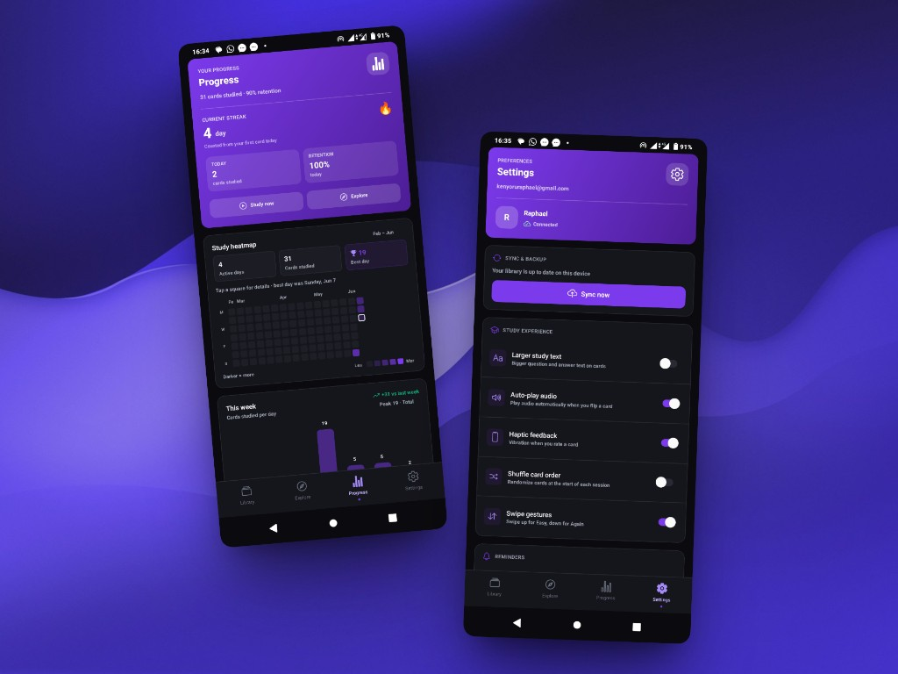
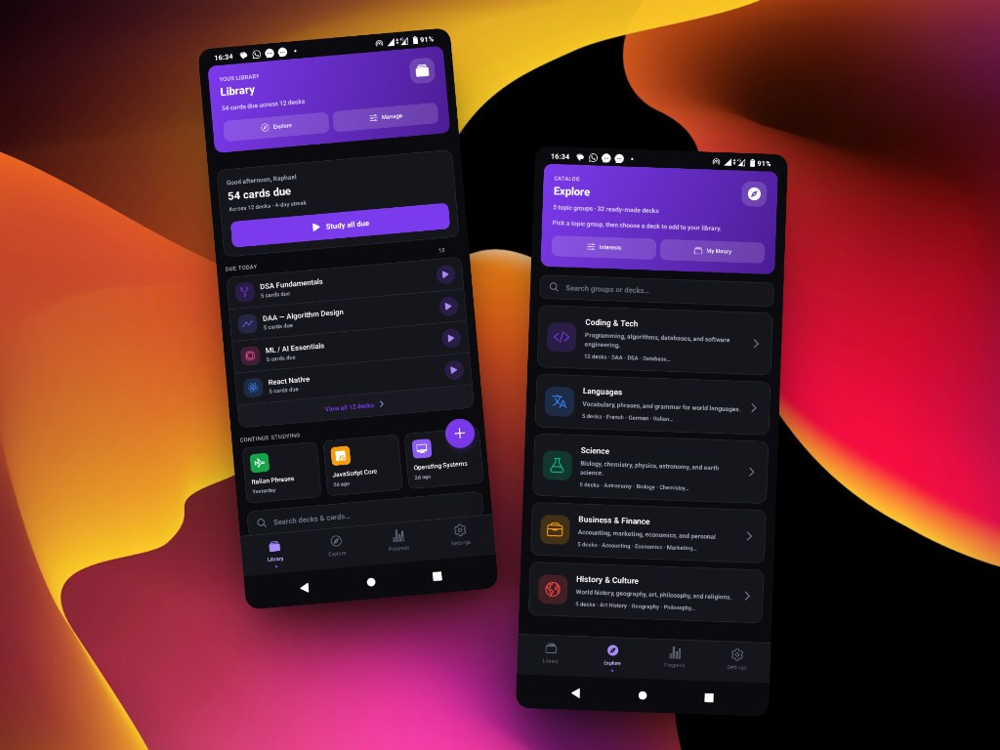
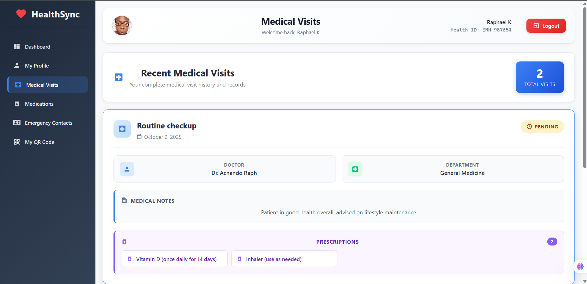
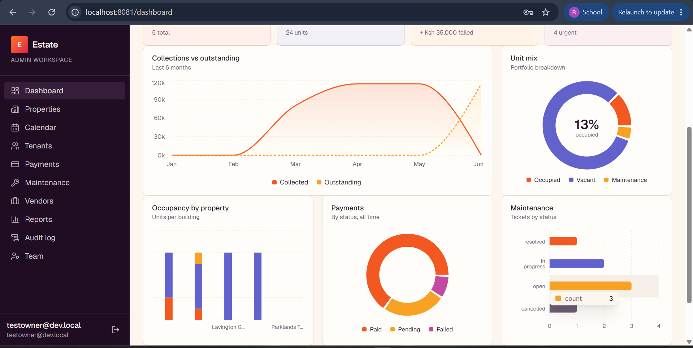

<div align="center">


<br/>

<a href="https://github.com/tyrtu">
  
</a>


</div>

<br/>

## 👨‍💻 About Me

I'm a 4th-year **BSc Software Engineering** student at **Kisii University** (Expected 2027), learning full-stack web and app development. Over the past year I've built several practical projects — from digital health identity systems to property management platforms — focused on creating simple, working applications that solve real problems.

```
🌍 Location     : Kisii, Kenya
🎓 Education    : Kisii University — BSc Software Engineering
🔭 Currently    : Building Synapse, an AI-powered spaced repetition app
🌱 Learning     : Laravel, advanced backend architecture
💬 Ask me about : React, React Native, Supabase, Firebase
⚡ Fun fact     : I'd rather ship something simple than something flashy and broken
```

<br/>

## 🛠️ Tech Stack

<div align="center">

**Languages**
<br/>


**Frameworks & Libraries**
<br/>


**Databases & Backend**
<br/>


**Tools**
<br/>


</div>

<br/>

## 🚀 Featured Projects

---

### 🧠 [Synapse](https://github.com/tyrtu/Synapse) — *In Progress*

<p align="center">
  
  
</p>

An AI-powered flashcard and spaced repetition app with streak tracking and study analytics.

- 🤖 AI-generated flashcards
- 📈 Spaced repetition algorithm
- 🔥 Streak tracking & study analytics
- 🎨 Polished onboarding & branding

`React Native` `Expo` `Appwrite` `NativeWind`

---

### ♟️ [Skill-Based Chess Staking Platform](https://github.com/tyrtu/stake-checkmate) — *2026* &nbsp;·&nbsp; [**🚀 Live Demo**](https://stake-checkmate-production.up.railway.app/)

<p align="center">
  
</p>

Players stake money on chess matches and compete live on Lichess; the winner automatically receives the funds.

- 💸 Pre-match staking
- ♟️ Real matches via Lichess API
- 🤖 Automatic result tracking & payouts
- 🔌 AI-assisted development

`React` `Node.js` `Supabase`

---

### 🩺 [Emergency Digital Health ID System](https://github.com/tyrtu/EMMERGENCY-DIGITAL-HEALTH-ID) — *2025*

<p align="center">
  
</p>

Lets emergency responders quickly find patient information (blood type, allergies, conditions) by scanning a QR code.

- 📷 QR code scanning
- ✏️ Editable patient records
- 🔐 Separate patient / staff login flows

`React` `Node.js` `MongoDB` `Tailwind CSS`

---

### 🏠 [Rental Property Management System](https://github.com/tyrtu/property-mgmt) — *2024*

<p align="center">
  
</p>

An app for landlords to list rental units, track tenants, and manage rent payments.

- 🏘️ Property & unit management
- 👤 Tenant tracking
- 💰 Rent payment records

`React` `Node.js` `Firebase`

---

<br/>

## 📊 GitHub Stats

<div align="center">


</div>

<br/>

## 🌐 Connect with me

<div align="center">

<a href="https://github.com/tyrtu"></a>
<a href="https://portfolio-sigma-one-qn0tpz6iie.vercel.app/"></a>

</div>


